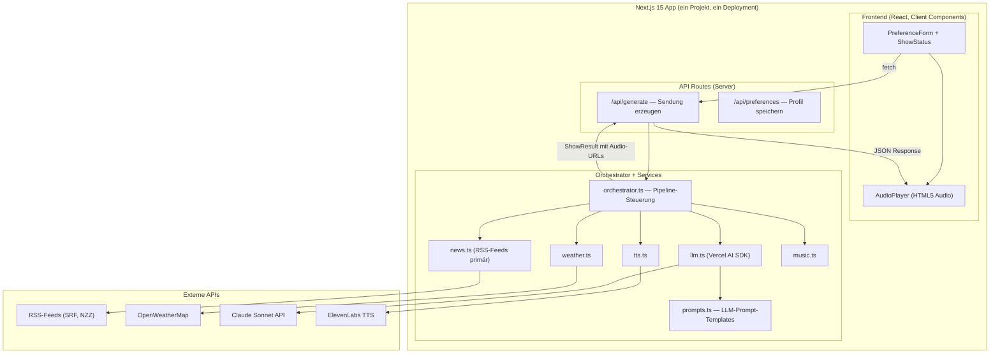
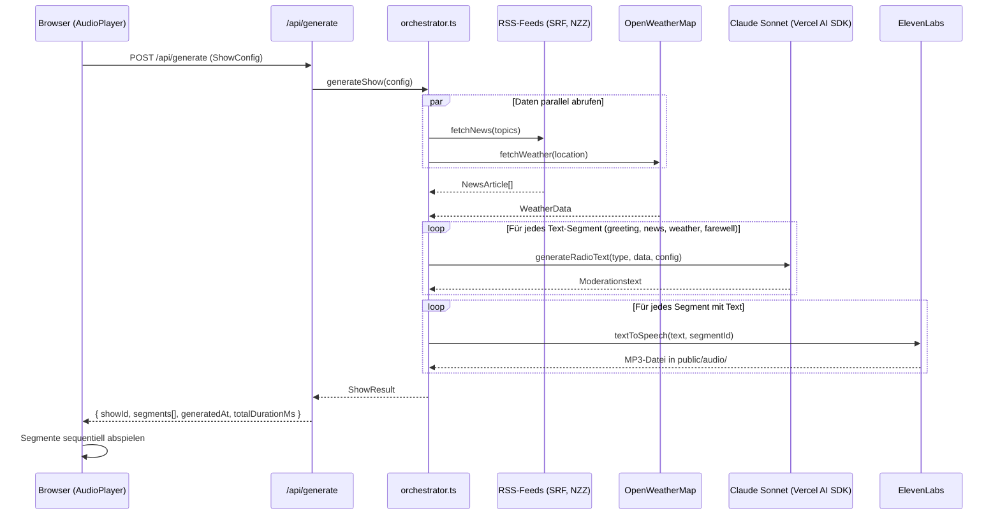
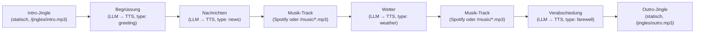
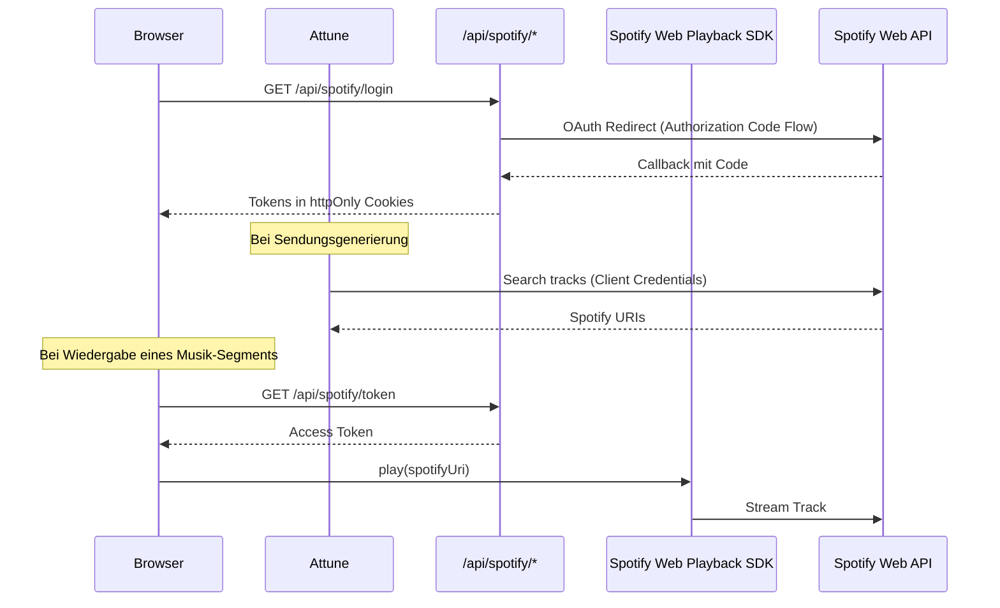

# Attune — Techstack & Architektur

## Übersicht

Techstack und Architektur für **Attune**, optimiert für maximale Einfachheit und Entwicklung mit **Claude Code**. Prinzip: so wenige Dependencies und Moving Parts wie möglich — alles in einem Next.js-Projekt, kein Redis, kein Docker, kein separater Server.

---

## 1. Architektur-Überblick

Alles läuft in einer einzigen Next.js-App. Das Frontend stellt den Player und die Einstellungen dar, die API Routes im selben Projekt übernehmen die gesamte Backend-Logik. Audio-Dateien werden als statische Dateien im `/public`-Ordner erzeugt und direkt vom Browser abgespielt — kein WebSocket, kein Streaming-Server nötig.



---

## 2. Datenfluss

Der Flow ist bewusst simpel: ein einziger API-Call löst die gesamte Pipeline aus und gibt ein `ShowResult` mit Audio-URLs zurück.



---

## 3. Techstack

Der gesamte Stack besteht aus **5 npm-Paketen** plus Next.js.

### Kern-Dependencies

| Paket | Version | Zweck |
|---|---|---|
| `next` (mit React 19, TypeScript, Tailwind CSS 4) | 15.3.1 | Fullstack-Framework — `create-next-app` liefert alles |
| `ai` + `@ai-sdk/anthropic` | 4.3.0 / 1.2.0 | Vercel AI SDK — Claude-Integration mit `generateText()` |
| `elevenlabs` | 1.0.0 | TTS SDK — Text rein, MP3 raus |
| `rss-parser` | 3.13.0 | RSS-Feeds parsen (SRF, NZZ) |

Das ist alles. Kein Redis, kein Socket.io, kein BullMQ, kein FFmpeg, kein tRPC, kein Zustand.

### Externe APIs

| Dienst | Anbieter | Kosten | Hinweis |
|---|---|---|---|
| **LLM** | Claude Sonnet (via Vercel AI SDK) | ~$3–5/Monat bei Demo-Nutzung | Model: `claude-sonnet-4-20250514` |
| **TTS** | ElevenLabs (Starter Plan) | $5/Monat (30k Zeichen) | Model: `eleven_multilingual_v2` (Deutsch-fähig) |
| **News** | RSS-Feeds (SRF, NZZ) primär, NewsAPI.org optional | Kostenlos | RSS als Primärquelle, da NewsAPI Free Tier nur auf localhost funktioniert |
| **Wetter** | OpenWeatherMap | Kostenlos (1000 Calls/Tag) | |
| **Musik** | Lokale MP3s in `/public/music/` | Kostenlos (lizenzfrei) | Fallback wenn Spotify nicht verbunden |
| **Musik (Bonus)** | Spotify Web API + Playback SDK | $0 (benötigt Premium-Account des Nutzers) | Volle Track-Wiedergabe via OAuth + Web Playback SDK |

**Total: ~$8–10/Monat**

### Mock-Modus

Alle Services erkennen automatisch, ob ihr API-Key gesetzt ist. Fehlt ein Key (oder enthält den Platzhalter-Wert), liefert der Service realistische Mock-Daten zurück. So funktioniert die gesamte Pipeline end-to-end auch ohne API-Keys — ideal für Entwicklung und UI-Tests.

### Hosting

| Option | Aufwand | Hinweis |
|---|---|---|
| **Lokal** (empfohlen für Usability-Studie) | `npm run dev` — für Entwicklung und Tests reicht localhost. | Audio-Dateien werden in `public/audio/` geschrieben — funktioniert nur lokal. |
| **Vercel** (Stretch Goal) | `vercel deploy` — Free Tier reicht für Demo. | `public/audio/` ist read-only auf Vercel. Workaround: Audio via `/api/audio/[id]` aus `/tmp` streamen. |

---

## 4. Projektstruktur

Flache, einfache Struktur — alles in einem Next.js-Projekt.

```
attune-app/
├── src/
│   ├── app/
│   │   ├── page.tsx                 # Hauptseite: Player + Einstellungen + Status (Client Component)
│   │   ├── layout.tsx               # Root Layout (lang="de")
│   │   ├── globals.css              # Tailwind CSS Imports
│   │   └── api/
│   │       ├── generate/
│   │       │   └── route.ts         # POST: Sendung generieren (ruft Orchestrator auf)
│   │       └── preferences/
│   │           └── route.ts         # GET/POST: Nutzerpräferenzen (JSON-Datei)
│   │
│   │       └── spotify/                 # Bonus: Spotify OAuth
│   │           ├── login/route.ts       # GET: Redirect zu Spotify Auth
│   │           ├── callback/route.ts    # GET: OAuth Callback, Token in Cookies
│   │           └── token/route.ts       # GET: Aktuellen Access Token zurückgeben
│   │
│   ├── components/
│   │   ├── AudioPlayer.tsx          # Play/Pause, Fortschritt, Segment-Navigation, Transkript
│   │   ├── PreferenceForm.tsx       # Themen-Chips, Standort, Moderationsstil, UUID-Management
│   │   ├── ShowStatus.tsx           # Ladezustand, Fehler, Generierungszeit
│   │   ├── SpotifyPlayer.tsx        # Bonus: Spotify Web Playback SDK Integration
│   │   └── SpotifyConnect.tsx       # Bonus: Spotify Login-Button + Verbindungsstatus
│   │
│   ├── services/
│   │   ├── news.ts                  # RSS-Feeds (SRF, NZZ) + Mock-Fallback
│   │   ├── weather.ts               # OpenWeatherMap + Mock-Fallback
│   │   ├── llm.ts                   # Claude via Vercel AI SDK + Mock-Fallback
│   │   ├── tts.ts                   # ElevenLabs TTS + Mock-Fallback
│   │   ├── music.ts                 # Spotify → lokale MP3s (Fallback-Kette)
│   │   └── spotify.ts               # Bonus: Spotify OAuth + Search + Token-Management
│   │
│   ├── lib/
│   │   ├── orchestrator.ts          # Pipeline: Daten → Text → Audio → ShowResult
│   │   ├── prompts.ts               # LLM System-Prompt + Segment-Prompt-Templates
│   │   └── types.ts                 # Shared Types (Segment, ShowConfig, ShowResult, etc.)
│   │
│   └── data/
│       └── preferences.json         # Nutzerpräferenzen (einfacher File-Store)
│
├── public/
│   ├── audio/                       # Generierte Sendungen (MP3s, zur Laufzeit erzeugt)
│   ├── music/                       # Lizenzfreie Musik-Tracks (MP3)
│   └── jingles/                     # Intro/Outro Jingles (MP3)
│
├── .env.local                       # API-Keys (ANTHROPIC, ELEVENLABS, OPENWEATHERMAP, SPOTIFY, etc.)
├── package.json
├── tsconfig.json
└── next.config.ts
```

### Warum so einfach?

**Kein Redis/DB** — Präferenzen werden in einer JSON-Datei gespeichert, Audio-Dateien direkt in `/public/audio/`. Für einen Demonstrator mit 5–8 Testpersonen reicht das völlig.

**Kein WebSocket** — Der `/api/generate`-Endpoint ruft den Orchestrator auf, der die gesamte Sendung generiert und ein `ShowResult` (Array von Segmenten mit Audio-URLs) zurückgibt. Der `AudioPlayer` spielt die Segmente sequentiell ab.

**Kein State-Management-Library** — React `useState`, `useEffect` und `useMemo` reichen für den gesamten Client-State.

**Kein tRPC** — Einfache `fetch()`-Calls an die API Routes. Typsicherheit über shared Types in `lib/types.ts`.

**Kein Agent-Framework** — Der Orchestrator ist eine einzige `async`-Funktion, die Services sequentiell aufruft. Konzeptionell eine Pipeline, die als «agentisches Framework» in der Thesis beschrieben werden kann.

**Mock-Modus** — Jeder Service liefert realistische Mock-Daten, wenn der zugehörige API-Key fehlt. Die gesamte App funktioniert out-of-the-box ohne externe APIs.

---

## 5. Orchestrator (Kernlogik)

Der Orchestrator ist eine einzige async-Funktion in `src/lib/orchestrator.ts` — kein Framework, kein Agent, nur eine Pipeline mit Timing-Logs.

```typescript
// src/lib/orchestrator.ts (vereinfacht)

async function generateShow(config: ShowConfig): Promise<ShowResult> {
  const showId = crypto.randomUUID();

  // 1. Daten parallel abrufen
  const [news, weather] = await Promise.all([
    fetchNews(config.topics),
    fetchWeather(config.location),
  ]);

  // 2. Musik-Tracks wählen (Spotify wenn konfiguriert, sonst lokal)
  const [music1, music2] = await Promise.all([pickTrack(), pickTrack()]);

  // 3. Sendungsplan erstellen (8 Segmente)
  const segments: Segment[] = [
    { id: uuid(), type: 'jingle', audioUrl: '/jingles/intro.mp3' },
    { id: uuid(), type: 'greeting' },
    { id: uuid(), type: 'news', data: news },
    { id: uuid(), type: 'music', audioUrl: music1.audioUrl, spotifyUri: music1.spotifyUri },
    { id: uuid(), type: 'weather', data: weather },
    { id: uuid(), type: 'music', audioUrl: music2.audioUrl, spotifyUri: music2.spotifyUri },
    { id: uuid(), type: 'farewell' },
    { id: uuid(), type: 'jingle', audioUrl: '/jingles/outro.mp3' },
  ];

  // 4. Texte generieren (LLM) — sequentiell für Rate-Limit-Sicherheit
  for (const seg of textSegments) {
    seg.text = await generateRadioText(seg.type, seg.data, config);
  }

  // 5. Texte zu Audio (TTS) — sequentiell für ElevenLabs-Limits
  for (const seg of textSegments) {
    seg.audioUrl = await textToSpeech(seg.text, seg.id);
  }

  // 6. ShowResult zurückgeben
  return { showId, segments, generatedAt: new Date().toISOString(), totalDurationMs };
}
```

### Prompt-System (`src/lib/prompts.ts`)

Die LLM-Prompts sind als eigenes Modul ausgelagert, um sie einfach iterieren zu können:

- **System-Prompt**: Definiert die Attune-Moderator-Persona (Schweizer Hochdeutsch, Ton, Format-Regeln)
- **Segment-Prompts**: Pro Segmenttyp (greeting, news, weather, farewell) ein Template mit dynamischen Daten (Uhrzeit, Wetter, Nachrichten, Standort, Moderationsstil)

---

## 6. Latenz-Strategie

Ziel: weniger als 30 Sekunden bis zum ersten hörbaren Beitrag.

**Implementiert: Ansatz 1 (Request-Response + Jingle-First)**

Der `AudioPlayer` kann das Intro-Jingle sofort abspielen (liegt als statische Datei in `/public/jingles/` vor), während `/api/generate` im Hintergrund die Sendung generiert. Sobald das `ShowResult` zurückkommt, spielt der Player die generierten Segmente sequentiell ab.

**Verfügbar als Upgrade: Ansatz 2 (SSE-Streaming)**

Falls die gemessene Latenz 30s übersteigt, kann `/api/generate` auf Server-Sent Events umgebaut werden (~20 Zeilen Code). Der Browser spielt dann jedes Segment ab, sobald es fertig ist.

```mermaid
gantt
    title Latenz-Ablauf (Ziel max 30s)
    dateFormat ss
    axisFormat %S s

    section Sofort
    Intro-Jingle abspielen       :a1, 00, 5s

    section Parallel
    News + Wetter abrufen        :a2, 00, 3s

    section Sequentiell
    LLM Text generieren (4x)    :a3, after a2, 10s
    TTS Audio erzeugen (4x)     :a4, after a3, 12s

    section Wiedergabe
    Erster Beitrag spielbar      :milestone, after a4, 0s
```



Der Orchestrator loggt die Dauer jedes Pipeline-Schritts in die Konsole, um Engpässe zu identifizieren.

---

## 7. Sendungsstruktur



Jedes Segment hat eine `id` (UUID), einen `type`, optional `text` (LLM-generiert), eine `audioUrl` (für HTML5 Audio) und/oder eine `spotifyUri` (für Spotify-Wiedergabe). Der `AudioPlayer` erkennt automatisch, ob ein Segment via HTML5 Audio oder Spotify Web Playback SDK abgespielt wird.

---

## 8. Profil-System (ohne Login)

Kein Auth-System. Stattdessen ein simples UUID-basiertes Profil:

- Beim ersten Besuch erstellt `PreferenceForm.tsx` eine UUID via `crypto.randomUUID()` und speichert sie im LocalStorage (`attune-userId`).
- Präferenzen (Themen, Ort, Moderationsstil) werden mit dieser UUID an `POST /api/preferences` gesendet und in `src/data/preferences.json` auf dem Server abgelegt.
- Beim nächsten Besuch lädt `PreferenceForm.tsx` die gespeicherten Präferenzen via `GET /api/preferences?userId=xxx`.
- Für die Usability-Studie reicht die UUID zur Zuordnung der Ergebnisse.

In der Thesis kann ein Ausblick beschreiben, wie ein produktionsreifes System Auth via NextAuth.js ergänzen würde.

---

## 9. Entwicklungsansatz

Das Projekt wurde mit Claude Code in folgender Reihenfolge aufgebaut (Bottom-up, Dependency-Reihenfolge):

1. **Foundation**: `types.ts` → Verzeichnisstruktur → `.env.local` → `preferences.json`
2. **Services** (jeweils mit Mock-Modus): `news.ts` → `weather.ts` → `prompts.ts` → `llm.ts` → `tts.ts` → `music.ts`
3. **Orchestrator**: `orchestrator.ts` — verbindet alle Services zur Pipeline
4. **API Routes**: `generate/route.ts` + `preferences/route.ts`
5. **Frontend**: `AudioPlayer.tsx` + `PreferenceForm.tsx` + `ShowStatus.tsx` → `page.tsx`
6. **Bonus — Spotify**: `spotify.ts` → OAuth-Routes → `SpotifyPlayer.tsx` + `SpotifyConnect.tsx` → Integration in `music.ts` + `AudioPlayer.tsx`
7. **Iterieren**: Prompt-Optimierung, SSE-Upgrade, UI-Polish, Usability-Vorbereitung

---

## 10. Kostenabschätzung

| Dienst | Kosten | Hinweis |
|---|---|---|
| Claude Sonnet API | ~$3–5/Monat | 4 Segmente à ~200 Tokens pro Sendung |
| ElevenLabs Starter | $5/Monat | 30k Zeichen, ~50 Sendungen/Monat |
| RSS-Feeds (SRF, NZZ) | $0 | Kein API-Key nötig |
| OpenWeatherMap | $0 (Free Tier) | 1000 Calls/Tag |
| Hosting (localhost) | $0 | Für Usability-Studie ausreichend |
| Spotify (Bonus) | $0 (Nutzer braucht Premium) | Keine API-Kosten, nur Premium-Abo des Nutzers |
| **Total** | **~$8–10/Monat** | |

---

## 11. Was bewusst weggelassen wurde

| Feature | Warum nicht | Ausblick (Thesis) |
|---|---|---|
| Redis / Datenbank | JSON-Datei reicht für 5–8 Testpersonen | PostgreSQL/Prisma für Produktion |
| WebSocket / Socket.io | Request-Response + HTML5 Audio reichen | SSE als Upgrade bereits vorbereitet |
| Docker | `npm run dev` / localhost reicht für Studie | Docker-Compose für Produktion |
| tRPC | Einfache fetch-Calls genügen | tRPC für typsichere API bei Skalierung |
| Auth (Login) | UUID-Profil in LocalStorage reicht für Demo | NextAuth.js oder Clerk |
| FFmpeg | Browser spielt einzelne Segmente sequentiell ab | FFmpeg für nahtloses Audio-Stitching |
| Agent-Framework (LangChain etc.) | Eigene Pipeline-Funktion im Orchestrator reicht | LangGraph für komplexere Orchestrierung |
| State-Management (Zustand etc.) | React useState/useMemo reichen für 3 Components | Zustand oder Jotai bei wachsender Komplexität |
| NewsAPI | RSS-Feeds sind zuverlässiger und kostenlos | NewsAPI als optionale Ergänzung integrierbar |

---

## 12. Bonus: Spotify-Integration

Die Musik-Segmente können optional über die **Spotify Web API** mit echten, vollständigen Tracks bespielt werden. Diese Funktion ist als Bonus implementiert — die App funktioniert vollständig auch ohne Spotify.

### Voraussetzungen

- Eine [Spotify Developer App](https://developer.spotify.com/dashboard) (Client ID + Client Secret)
- Der Nutzer benötigt ein **Spotify Premium**-Konto (Voraussetzung für das Web Playback SDK)
- `NEXT_PUBLIC_SPOTIFY_ENABLED=true` in `.env.local`

### Architektur



### Fallback-Kette

```
music.ts: pickTrack()
├── Spotify konfiguriert? → spotify.ts: getRandomTrack() → { spotifyUri, trackName }
│   └── Fehlgeschlagen? → Lokale MP3
└── Nicht konfiguriert? → Lokale MP3 aus /public/music/
```

Der `AudioPlayer` erkennt pro Segment, ob `spotifyUri` oder `audioUrl` vorhanden ist:
- **Spotify-Segment**: Wird an `SpotifyPlayer.tsx` delegiert (Web Playback SDK)
- **Lokales Segment**: Wird via HTML5 `<audio>` Element abgespielt

### Dateien

| Datei | Zweck |
|---|---|
| `src/services/spotify.ts` | OAuth-Flows (Client Credentials + Authorization Code), Track-Suche, Token-Refresh |
| `src/app/api/spotify/login/route.ts` | Redirect zu Spotify OAuth (mit CSRF-State in Cookie) |
| `src/app/api/spotify/callback/route.ts` | Token-Austausch, Speicherung in httpOnly Cookies |
| `src/app/api/spotify/token/route.ts` | Access Token für Client-SDK bereitstellen (mit Auto-Refresh) |
| `src/components/SpotifyPlayer.tsx` | Web Playback SDK Wrapper, Track-Wiedergabe, Polling für Track-Ende |
| `src/components/SpotifyConnect.tsx` | Login-Button + Verbindungsstatus-Anzeige |

### Aktivierung

1. Spotify Developer App erstellen und Redirect URI `http://localhost:3000/api/spotify/callback` hinzufügen
2. In `.env.local` setzen:
   ```
   SPOTIFY_CLIENT_ID=dein-client-id
   SPOTIFY_CLIENT_SECRET=dein-client-secret
   NEXT_PUBLIC_SPOTIFY_ENABLED=true
   ```
3. App neu starten, auf «Mit Spotify verbinden» klicken und einloggen
