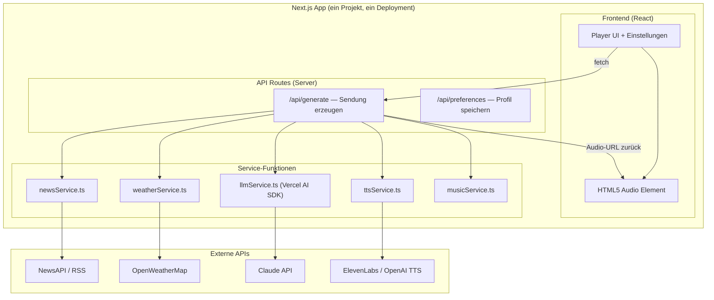
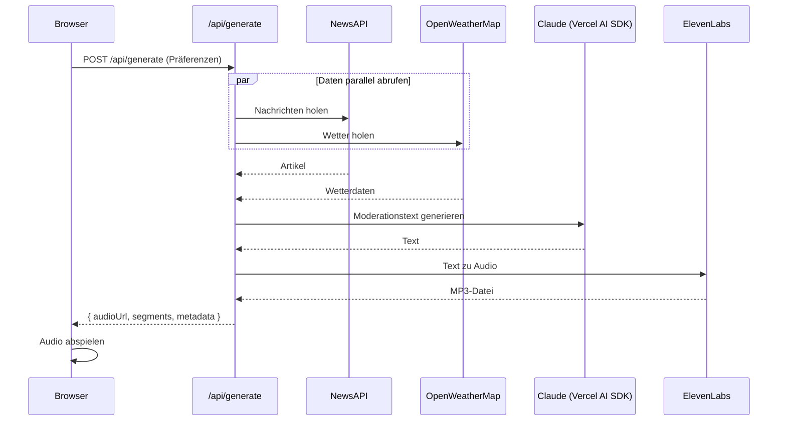
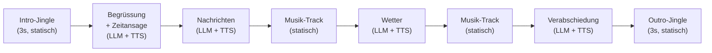

# Radion 25 — Techstack & Architektur

## Übersicht

Techstack und Architektur für **Radion 25**, optimiert für maximale Einfachheit und Entwicklung mit **Claude Code**. Prinzip: so wenige Dependencies und Moving Parts wie möglich — alles in einem Next.js-Projekt, kein Redis, kein Docker, kein separater Server.

---

## 1. Architektur-Überblick

Alles läuft in einer einzigen Next.js-App. Das Frontend stellt den Player und die Einstellungen dar, die API Routes im selben Projekt übernehmen die gesamte Backend-Logik. Audio-Dateien werden als statische Dateien im `/public`-Ordner erzeugt und direkt vom Browser abgespielt — kein WebSocket, kein Streaming-Server nötig.



---

## 2. Datenfluss

Der Flow ist bewusst simpel: ein einziger API-Call löst die gesamte Pipeline aus und gibt eine Audio-URL zurück.



---

## 3. Techstack

Der gesamte Stack besteht aus **5 npm-Paketen** plus Next.js.

### Kern-Dependencies

| Paket | Zweck |
|---|---|
| `next` (mit React, TypeScript, Tailwind) | Fullstack-Framework — `create-next-app` liefert alles |
| `ai` + `@ai-sdk/anthropic` | Vercel AI SDK — Claude-Integration mit einer Zeile Code |
| `elevenlabs` | TTS SDK — Text rein, MP3 raus |
| `rss-parser` | RSS-Feeds parsen (SRF, etc.) |

Das ist alles. Kein Redis, kein Socket.io, kein BullMQ, kein FFmpeg, kein tRPC, kein Zustand.

### Externe APIs

| Dienst | Anbieter | Kosten |
|---|---|---|
| **LLM** | Claude Sonnet (via Vercel AI SDK) | ~$3–5/Monat bei Demo-Nutzung |
| **TTS** | ElevenLabs (Starter Plan) | $5/Monat (30k Zeichen) |
| **News** | NewsAPI.org + RSS-Feeds (SRF) | Kostenlos |
| **Wetter** | OpenWeatherMap | Kostenlos (1000 Calls/Tag) |
| **Musik** | Lokale MP3s in `/public/music/` | Kostenlos (lizenzfrei) |

**Total: ~$8–10/Monat**

### Hosting

| Option | Aufwand |
|---|---|
| **Vercel** (empfohlen) | `vercel deploy` — fertig. Free Tier reicht für Demo. |
| **Lokal** | `npm run dev` — für Entwicklung und Usability-Tests reicht localhost. |

---

## 4. Projektstruktur

Flache, einfache Struktur — Claude Code kann das in einem Rutsch scaffolden.

```
radion25/
├── src/
│   ├── app/
│   │   ├── page.tsx                 # Hauptseite: Player + Steuerung
│   │   ├── layout.tsx               # Root Layout
│   │   └── api/
│   │       ├── generate/
│   │       │   └── route.ts         # POST: Sendung generieren (Hauptlogik)
│   │       └── preferences/
│   │           └── route.ts         # GET/POST: Nutzerpräferenzen (JSON-Datei)
│   │
│   ├── components/
│   │   ├── AudioPlayer.tsx          # Play/Pause, Fortschritt, Segmentanzeige
│   │   ├── PreferenceForm.tsx       # Themen, Ort, Sprachstil wählen
│   │   └── ShowStatus.tsx           # Ladezustand, aktuelles Segment
│   │
│   ├── services/
│   │   ├── news.ts                  # NewsAPI + RSS abrufen und normalisieren
│   │   ├── weather.ts               # OpenWeatherMap abrufen
│   │   ├── llm.ts                   # Claude-Aufruf via Vercel AI SDK
│   │   ├── tts.ts                   # ElevenLabs Text-to-Speech
│   │   └── music.ts                 # Zufälligen Track aus /public/music wählen
│   │
│   ├── lib/
│   │   ├── orchestrator.ts          # Pipeline: Daten → Text → Audio → Playlist
│   │   └── types.ts                 # Shared Types (Segment, ShowConfig, etc.)
│   │
│   └── data/
│       └── preferences.json         # Nutzerpräferenzen (einfacher File-Store)
│
├── public/
│   ├── audio/                       # Generierte Sendungen (MP3s)
│   ├── music/                       # Lizenzfreie Musik-Tracks (MP3)
│   └── jingles/                     # Intro/Outro Jingles (MP3)
│
├── .env.local                       # API-Keys
├── package.json
├── tsconfig.json
└── next.config.ts
```

### Warum so einfach?

**Kein Redis/DB** — Präferenzen werden in einer JSON-Datei gespeichert, Audio-Dateien direkt in `/public/audio/`. Für einen Demonstrator mit 5–8 Testpersonen reicht das völlig.

**Kein WebSocket** — Der `/api/generate`-Endpoint erzeugt die gesamte Sendung, speichert die Audio-Dateien und gibt eine Playlist (Array von URLs) zurück. Der Browser spielt sie nacheinander ab. Einfacher geht's nicht.

**Kein State-Management-Library** — React `useState` und `useEffect` reichen für den Player-State.

**Kein tRPC** — Einfache `fetch()`-Calls an die API Routes. Typsicherheit über shared Types in `lib/types.ts`.

---

## 5. Orchestrator (Kernlogik)

Der Orchestrator ist eine einzige async-Funktion — kein Framework, kein Agent, nur eine Pipeline.

```typescript
// Pseudocode: src/lib/orchestrator.ts

async function generateShow(config: ShowConfig): Promise<ShowResult> {
  // 1. Daten parallel abrufen
  const [news, weather] = await Promise.all([
    fetchNews(config.topics),
    fetchWeather(config.location),
  ]);

  // 2. Sendungsplan erstellen
  const segments: Segment[] = [
    { type: "jingle", file: "/jingles/intro.mp3" },
    { type: "greeting", text: null },        // wird generiert
    { type: "news", text: null, data: news },
    { type: "music", file: pickRandomTrack() },
    { type: "weather", text: null, data: weather },
    { type: "music", file: pickRandomTrack() },
    { type: "farewell", text: null },
    { type: "jingle", file: "/jingles/outro.mp3" },
  ];

  // 3. Texte generieren (LLM)
  for (const seg of segments.filter(s => s.text === null)) {
    seg.text = await generateText(seg.type, seg.data, config);
  }

  // 4. Texte zu Audio (TTS)
  for (const seg of segments.filter(s => s.text)) {
    seg.file = await textToSpeech(seg.text);
  }

  // 5. Playlist zurückgeben
  return {
    segments: segments.map(s => ({
      type: s.type,
      audioUrl: s.file,
      text: s.text,
    })),
  };
}
```

---

## 6. Latenz-Strategie

Ziel: weniger als 30 Sekunden bis zum ersten hörbaren Beitrag.

**Ansatz 1 (einfach):** Intro-Jingle sofort abspielen (liegt als statische Datei vor), während `/api/generate` im Hintergrund läuft. Wenn die API fertig ist, geht's nahtlos weiter.

**Ansatz 2 (segmentweise):** Die API generiert Segment für Segment und streamt die URLs via Server-Sent Events (SSE) zurück. Der Browser beginnt die Wiedergabe, sobald das erste Segment fertig ist.

```mermaid
gantt
    title Latenz-Ablauf (Ziel max 30s)
    dateFormat ss
    axisFormat %S s

    section Sofort
    Intro-Jingle abspielen       :a1, 00, 5s

    section Parallel
    News + Wetter abrufen        :a2, 00, 3s

    section Sequentiell
    LLM Text generieren          :a3, after a2, 6s
    TTS Audio erzeugen           :a4, after a3, 8s

    section Wiedergabe
    Erster Beitrag spielbar      :milestone, after a4, 0s
```



Empfehlung: **Starte mit Ansatz 1** (simpelster möglicher Flow). Falls die Latenz zu hoch ist, kannst du auf SSE upgraden — das ist mit Next.js API Routes in ~20 Zeilen Code gemacht.

---

## 7. Sendungsstruktur



---

## 8. Profil-System (ohne Login)

Kein Auth-System. Stattdessen ein simples UUID-basiertes Profil:

- Beim ersten Besuch erstellt der Browser eine UUID (`crypto.randomUUID()`) und speichert sie im LocalStorage.
- Präferenzen (Themen, Ort, Sprachstil) werden mit dieser UUID an `/api/preferences` gesendet und in einer JSON-Datei auf dem Server abgelegt.
- Für die Usability-Studie reicht die UUID zur Zuordnung der Ergebnisse.

In der Thesis kann ein Ausblick beschreiben, wie ein produktionsreifes System Auth via NextAuth.js ergänzen würde.

---

## 9. Claude Code Workflow

So würdest du das Projekt mit Claude Code aufbauen — Schritt für Schritt:

**Schritt 1 — Projekt scaffolden:**
```
"Erstelle ein Next.js 15 Projekt mit TypeScript, Tailwind CSS und App Router.
Installiere: ai @ai-sdk/anthropic elevenlabs rss-parser"
```

**Schritt 2 — Services bauen (einer nach dem anderen):**
```
"Erstelle src/services/news.ts — eine Funktion fetchNews(topics: string[])
die NewsAPI und SRF RSS-Feed abfragt und normalisierte Artikel zurückgibt."
```
```
"Erstelle src/services/weather.ts — eine Funktion fetchWeather(city: string)
die OpenWeatherMap abfragt."
```
```
"Erstelle src/services/llm.ts — nutze das Vercel AI SDK mit Claude Sonnet.
Eine Funktion generateRadioText(type, data, config) die Moderationstext erzeugt."
```
```
"Erstelle src/services/tts.ts — nutze das ElevenLabs SDK.
Eine Funktion textToSpeech(text) die MP3-Dateien in public/audio/ speichert."
```

**Schritt 3 — Orchestrator:**
```
"Erstelle src/lib/orchestrator.ts — eine Pipeline-Funktion die alle Services
orchestriert und eine Playlist von Audio-URLs zurückgibt."
```

**Schritt 4 — API Route:**
```
"Erstelle src/app/api/generate/route.ts — POST-Endpoint der den Orchestrator
aufruft und die Playlist als JSON zurückgibt."
```

**Schritt 5 — Frontend:**
```
"Erstelle die Hauptseite mit einem Audio-Player der die Playlist abspielt,
einem Präferenz-Formular und einer Segmentanzeige."
```

**Schritt 6 — Iterieren:**
Verfeinerungen (Crossfading, bessere Prompts, SSE-Streaming) können einzeln als Follow-up-Prompts in Claude Code gemacht werden.

---

## 10. Kostenabschätzung

| Dienst | Kosten |
|---|---|
| Claude Sonnet API | ~$3–5/Monat |
| ElevenLabs Starter | $5/Monat |
| NewsAPI | $0 (Free Tier) |
| OpenWeatherMap | $0 (Free Tier) |
| Vercel Hosting | $0 (Free Tier) |
| **Total** | **~$8–10/Monat** |

---

## 11. Was bewusst weggelassen wurde

| Feature | Warum nicht | Ausblick (Thesis) |
|---|---|---|
| Redis / Datenbank | JSON-Datei reicht für Demo | PostgreSQL/Prisma für Produktion |
| WebSocket / Socket.io | HTTP-Responses + HTML5 Audio reichen | SSE oder WebSocket für Echtzeit-Streaming |
| Docker | `npm run dev` / Vercel reicht | Docker-Compose für Produktion |
| tRPC | Einfache fetch-Calls genügen | tRPC für typsichere API bei Skalierung |
| Auth (Login) | UUID-Profil reicht für Demo | NextAuth.js oder Clerk |
| FFmpeg | Browser spielt einzelne Segmente ab | FFmpeg für nahtloses Audio-Stitching |
| Agent-Framework | Eigene Pipeline-Funktion reicht | LangGraph für komplexere Orchestrierung |
