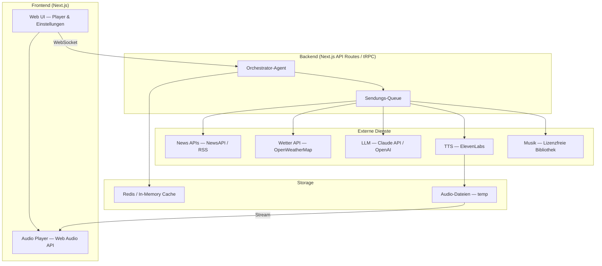
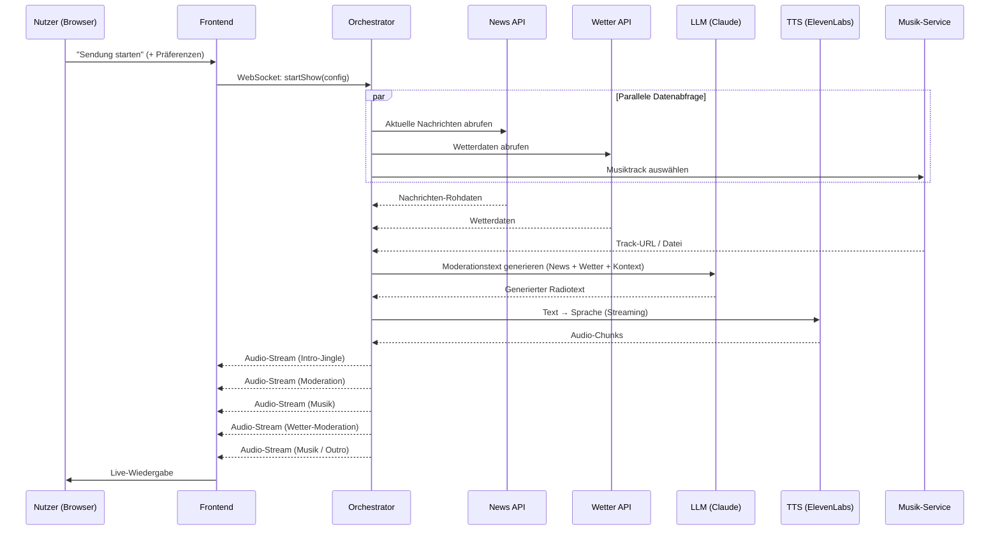
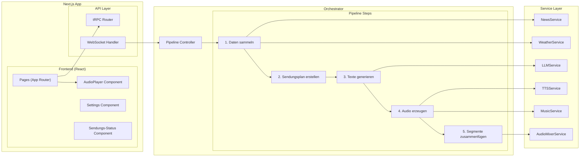
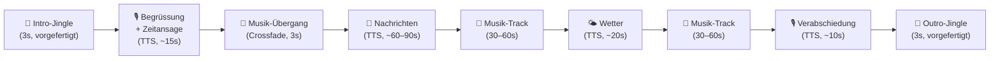

# Radion 25 — Techstack & Architektur

## Übersicht

Dieses Dokument beschreibt den empfohlenen Techstack und die Systemarchitektur für **Radion 25**, einen vollautomatisierten Radio-Demonstrator. Der Stack ist auf TypeScript/Node.js ausgelegt und priorisiert Entwicklungsgeschwindigkeit, gute DX (Developer Experience) und moderate Kosten.

---

## 1. Architektur-Überblick

Das System folgt einer **Pipeline-Architektur** mit einem zentralen Orchestrator-Agenten, der die einzelnen Schritte koordiniert. Die Webapplikation kommuniziert via WebSocket mit dem Backend, um den Audio-Stream in Echtzeit auszuliefern.



---

## 2. High-Level Datenfluss

Der Ablauf einer Sendungsgenerierung folgt dieser Pipeline:



---

## 3. Techstack im Detail

### 3.1 Frontend

| Komponente | Technologie | Begründung |
|---|---|---|
| **Framework** | **Next.js 15 (App Router)** | Fullstack-Fähigkeit, SSR, API-Routes, exzellentes TypeScript-Ökosystem |
| **UI Library** | **React 19** | Komponentenbasiert, riesiges Ökosystem, gute Audio-Integration |
| **Styling** | **Tailwind CSS** | Schnelle Entwicklung, konsistentes Design ohne separates CSS |
| **State Management** | **Zustand** | Leichtgewichtig, TypeScript-first, perfekt für Audio-Player-State |
| **Audio Playback** | **Web Audio API + Howler.js** | Professionelle Audio-Steuerung, Crossfading zwischen Segmenten |
| **Echtzeit-Komm.** | **Socket.io (Client)** | Robuste WebSocket-Verbindung mit Auto-Reconnect |

### 3.2 Backend

| Komponente | Technologie | Begründung |
|---|---|---|
| **Runtime** | **Node.js 22 (LTS)** | Nativer TypeScript-Support, performant für I/O-lastige Workloads |
| **API Layer** | **Next.js API Routes + tRPC** | Typsicherer Fullstack-Ansatz, kein separater Backend-Server nötig |
| **Echtzeit** | **Socket.io (Server)** | Bidirektionale Kommunikation für Live-Audio-Streaming |
| **Task Queue** | **BullMQ (Redis-basiert)** | Robuste Job-Verarbeitung, Retry-Logik, Priorisierung |
| **Audio Processing** | **FFmpeg (via fluent-ffmpeg)** | Zusammenfügen von Audiosegmenten, Format-Konvertierung, Crossfading |
| **Caching** | **Redis** | Caching von API-Responses (News, Wetter), Session-State |

### 3.3 Orchestrator / Agentisches Framework

| Komponente | Technologie | Begründung |
|---|---|---|
| **Agent Framework** | **Eigener Orchestrator (TypeScript)** | Volle Kontrolle, kein Overhead durch generische Agent-Frameworks; für den Scope einer BSc-Arbeit ausreichend und besser nachvollziehbar |
| **Alternative** | **Vercel AI SDK** | Falls ein leichtgewichtiges SDK für LLM-Streaming gewünscht ist — integriert sich nahtlos in Next.js |

**Empfehlung:** Für eine BSc-Arbeit ist ein eigener Orchestrator (State Machine / Pipeline) empfehlenswert, da Frameworks wie LangChain oder CrewAI oft mehr Komplexität einführen als sie lösen. Ein klar strukturierter Pipeline-Controller in TypeScript ist leichter zu debuggen, zu dokumentieren und für die Thesis zu erklären. Das Vercel AI SDK kann ergänzend für das LLM-Streaming eingesetzt werden.

### 3.4 Externe APIs und Dienste

| Dienst | Anbieter | Kosten | Begründung |
|---|---|---|---|
| **LLM** | **Anthropic Claude (Sonnet)** | ~$3/1M input, ~$15/1M output tokens | Exzellente Textqualität, gutes Deutsch, schnell genug für Near-Realtime |
| **LLM (Alternative)** | OpenAI GPT-4o-mini | ~$0.15/1M input | Günstiger, für einfachere Textsegmente |
| **TTS** | **ElevenLabs** | Free Tier: 10k Zeichen/Monat; Starter: $5/Monat (30k) | Beste Qualität, natürliche Stimmen, Streaming-API, Deutsch-Support |
| **TTS (Alternative)** | OpenAI TTS | $15/1M Zeichen | Gut und günstiger, etwas weniger natürlich |
| **News** | **NewsAPI.org** | Free Tier: 100 Req/Tag | Einfache REST-API, gute Abdeckung, reicht für Demo |
| **News (Ergänzung)** | RSS-Feeds (SRF, Tagesanzeiger) | Kostenlos | Schweizer Nachrichten, kein API-Key nötig |
| **Wetter** | **OpenWeatherMap** | Free Tier: 1000 Calls/Tag | Zuverlässig, gute Doku, standortbezogen |
| **Musik** | **Pixabay Music API / lokale Bibliothek** | Kostenlos | Lizenzfreie Musik, keine GEMA/SUISA-Probleme |

### 3.5 Infrastruktur und Deployment

| Komponente | Technologie | Begründung |
|---|---|---|
| **Hosting** | **Vercel (Frontend) + Railway/Fly.io (Backend)** | Vercel für Next.js-Frontend optimal; Railway/Fly.io für den Audio-Processing-Server mit WebSocket und FFmpeg |
| **Alternative** | **Docker + beliebiger VPS** | Falls alles auf einem Server laufen soll (z.B. Hetzner, ~€5/Monat) |
| **Cache/Queue** | **Upstash Redis** | Serverless Redis, Free Tier grosszügig, perfekt für BullMQ |
| **Monitoring** | **Vercel Analytics + eigenes Logging** | Einfach, reicht für BSc-Scope |

---

## 4. Komponentenarchitektur



---

## 5. Projektstruktur (Vorschlag)

```
radion25/
├── src/
│   ├── app/                      # Next.js App Router
│   │   ├── page.tsx              # Hauptseite mit Player
│   │   ├── settings/             # Personalisierung
│   │   └── api/                  # API Routes
│   │       └── trpc/             # tRPC Endpoint
│   │
│   ├── components/               # React-Komponenten
│   │   ├── AudioPlayer.tsx       # Zentraler Player
│   │   ├── ShowStatus.tsx        # Sendungsstatus
│   │   ├── PreferencePanel.tsx   # Nutzer-Einstellungen
│   │   └── Visualizer.tsx        # Audio-Visualisierung
│   │
│   ├── server/                   # Backend-Logik
│   │   ├── orchestrator/
│   │   │   ├── pipeline.ts       # Zentrale Pipeline-Steuerung
│   │   │   ├── scheduler.ts      # Sendungsplan (Segmentreihenfolge)
│   │   │   └── types.ts          # Segment-Types, Show-Config
│   │   │
│   │   ├── services/
│   │   │   ├── news.service.ts   # NewsAPI + RSS-Feed Integration
│   │   │   ├── weather.service.ts
│   │   │   ├── llm.service.ts    # Claude/OpenAI Textgenerierung
│   │   │   ├── tts.service.ts    # ElevenLabs Sprachsynthese
│   │   │   ├── music.service.ts  # Musik-Auswahl und -Streaming
│   │   │   └── audio.service.ts  # FFmpeg Mixing/Stitching
│   │   │
│   │   ├── trpc/                 # tRPC Router-Definition
│   │   └── websocket/            # Socket.io Server
│   │
│   ├── lib/                      # Shared Utilities
│   │   ├── audio-utils.ts
│   │   └── config.ts
│   │
│   └── types/                    # Gemeinsame TypeScript-Types
│       └── index.ts
│
├── public/
│   └── audio/                    # Jingles, Intros (statisch)
│
├── scripts/                      # Build- und Hilfs-Skripte
├── tests/                        # Test-Dateien
├── .env.local                    # API-Keys (nicht committen!)
├── package.json
├── tsconfig.json
├── next.config.ts
└── README.md
```

---

## 6. Latenz-Optimierung

Die Ziellatenz von < 30 Sekunden bis zum ersten Beitrag ist ambitioniert. Folgende Strategien helfen:

**Parallelisierung** — News, Wetter und Musikauswahl gleichzeitig abfragen (`Promise.all`), während der LLM-Aufruf vorbereitet wird.

**Streaming** — Sowohl die LLM-Textgenerierung (Streaming Response) als auch die TTS-Konvertierung (ElevenLabs Streaming API) unterstützen Chunk-basiertes Streaming. Dadurch kann die Sprachsynthese beginnen, bevor der gesamte Text fertig ist.

**Pre-Generation** — Ein Intro-Jingle oder eine Begrüssung kann sofort abgespielt werden, während die eigentlichen Inhalte im Hintergrund generiert werden. Dies überbrückt die Latenz.

**Caching** — News und Wetterdaten ändern sich nicht sekündlich. Ein Redis-Cache mit TTL von 5–15 Minuten reduziert API-Calls und Latenz.

```mermaid
gantt
    title Latenz-optimierter Ablauf (Ziel max 30s)
    dateFormat ss
    axisFormat %S s

    section Sofort
    Intro-Jingle abspielen       :a1, 00, 5s

    section Parallel (t=0)
    News API abrufen             :a2, 00, 3s
    Wetter API abrufen           :a3, 00, 2s
    Musik-Track laden            :a4, 00, 2s

    section Sequentiell
    LLM Text generieren (Stream) :a5, after a2, 8s
    TTS Audio erzeugen (Stream)  :a6, after a5, 10s

    section Wiedergabe
    Erster Beitrag abspielen     :milestone, after a6, 0s
```



---

## 7. Sendungsstruktur (Beispiel)

Ein typischer Sendungsablauf besteht aus mehreren Segmenten:



---

## 8. Kostenabschätzung (monatlich, Entwicklung/Demo)

| Dienst | Nutzung (geschätzt) | Kosten |
|---|---|---|
| Claude Sonnet API | ~50 Sendungen à ~2000 Tokens | ~$2–5 |
| ElevenLabs (Starter) | ~30k Zeichen/Monat | $5 |
| NewsAPI | Free Tier (100 Req/Tag) | $0 |
| OpenWeatherMap | Free Tier | $0 |
| Hosting (Railway) | Hobby Plan | $5 |
| Upstash Redis | Free Tier | $0 |
| **Total** | | **~$12–15/Monat** |

---

## 9. Technologie-Entscheidungen und Alternativen

### Agent-Framework: Eigenbau vs. LangChain/CrewAI

Für die BSc-Arbeit empfehle ich einen **eigenen Pipeline-Orchestrator**. Die Gründe: Die Pipeline ist relativ linear (Daten → Text → Audio → Abspielen), was kein komplexes Agent-Reasoning erfordert. Ein eigener Orchestrator ist einfacher zu debuggen und in der Thesis nachvollziehbar zu beschreiben. LangChain oder CrewAI würden Overhead einführen, der im 10-Wochen-Zeitrahmen schwer zu rechtfertigen ist. Falls in der Thesis trotzdem ein "agentisches Framework" gewünscht ist, kann der eigene Orchestrator als solches beschrieben und positioniert werden.

### Monorepo vs. getrennte Services

Ein **Next.js-Monolith** (Frontend + Backend in einem Projekt) ist für den BSc-Scope ideal. Microservices wären Over-Engineering. Falls Audio-Processing zu ressourcenintensiv wird, kann der FFmpeg-Teil als separater Worker ausgelagert werden.

### ElevenLabs vs. OpenAI TTS

ElevenLabs bietet die natürlichsten deutschen Stimmen und eine Streaming-API, die für das Radio-Feeling entscheidend ist. OpenAI TTS ist eine gute Fallback-Option (günstiger, einfacher), klingt aber etwas "robotischer".

---

## 10. Nächste Schritte

1. **Projekt aufsetzen:** `npx create-next-app@latest radion25 --typescript --tailwind --app`
2. **Durchstich (AP3):** Minimaler Flow — eine News abrufen → Claude-Text → ElevenLabs-Audio → im Browser abspielen
3. **Iterieren:** Wetter, Musik, Crossfading, Personalisierung schrittweise ergänzen
4. **Usability-Studie:** Ab Woche 7 mit dem erweiterten Demonstrator
